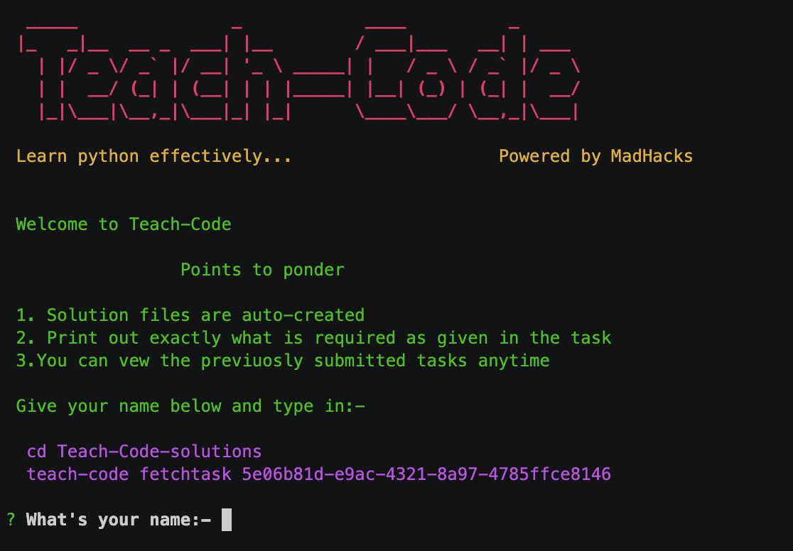

<p align="center">
  <a href="https://teachcode.madhacks.co"></a>
  <h1 align="center">teachcode</h1>
</p>

<p align="center">
	<a href="https://travis-ci.com/madlabsinc/teachcode"></a>
	<a href="https://www.npmjs.com/package/teach-code"></a>
	<a href="https://www.npmjs.com/package/teach-code"></a>
	<a href="https://github.com/madlabsinc/teachcode/pull/new"></a>
	<a href="https://github.com/prettier/prettier"></a>
	<a href="https://github.com/ulivz/awesome-vuepress"></a>
	<a href="https://github.com/madlabsinc/teachcode/blob/master/LICENSE"></a>
	
</p>

<p align="center">
	<a href='https://www.buymeacoffee.com/jamesgeorge007' target='_blank'></a>
</p>


> A tool to develop and improve a student’s programming skills by introducing the earliest lessons of coding.

## Installation

`npm install -g teach-code`

## Demo video

<a href="https://asciinema.org/a/Dt6tL9vo6wAWqhh7nvwEFTMqA" target="_blank" rel="noreferrer noopener">
	
</a>

Check out the demo video here: https://asciinema.org/a/Dt6tL9vo6wAWqhh7nvwEFTMqA

## How to use

Users are required to solve 30 tasks that take them through the basic constructs of the programming language of their choice. The tasks are designed in such a way that the complexity increases as users progress through the tasks. Users can't move forward until the current task is completed (since the progress is determined by a unique key that is generated upon successful completion). Previously submitted tasks can be viewed as desired by the user but can't be worked on again.

- `teachcode` expects you to have a GitHub account. Make sure that you create one if that's not the case.
- Navigate to the directory of your choice and type in `teachcode init`.
- Follow the instructions as prompted.
- Now type in `cd teachcode-solutions`.
- Grab the initial key and type in `teachcode fetchtask <key>`.
- Hurray :tada: you've got your first task.
- Now you can find a `config.json` and `task1.py` (language of choice) file within the `teachcode-solutions` directory.
- Open up your favourite editor and code up the solution.
- Now type in `teachcode submit`.
- Enter your Git credentials when prompted.
- If the current solution satisfies all test cases, you'll get the key to proceed with.
- Grab the key and type in `teachcode fetchtask <key>`.

## Available Commands

| command | description |
| -------------- |  ---------------- |
| teachcode init | Initializes all the tasks |
| teachcode fetchtask <key> | Fetches the task correponding to key provided |
| teachcode submit | Submits the current task |
| teachcode showkeys | Shows all the keys grabbed |
| teachcode showcommands | Lists all the available commands |

## Contributing

Contributions of any kind are welcomed. Make sure that you go through these [guidelines](https://teachcode.madlabs.xyz/guide/contributing.html).

### How should I write a commit message?

This project uses [Commitlint](https://github.com/conventional-changelog/commitlint/#what-is-commitlint) to check if the commit messages meet the [conventional commit format](https://www.conventionalcommits.org/en/v1.0.0/).

The full pattern is:
```sh
type(scope?): subject #scope is optional

body? #body is optional

footer? #footer is optional
```

Following that pattern, your commit messages should look like these:
```sh
feat: activate open collective
```

```sh
chore: correct typo

It should be "guest" and not "gest"
```

```sh
refactor(cli): drop support for node 6

BREAKING CHANGE: you will need to update your node version to keep using this CLI
This closes #123
```

### How should I name my branches?

Prefix your branch names with `feat/`, `docs/` or `hotfix/` for feature proposals, documentation and bug fixes, respectively.

## License

Licensed under `GNU General Public License V3.0`.
